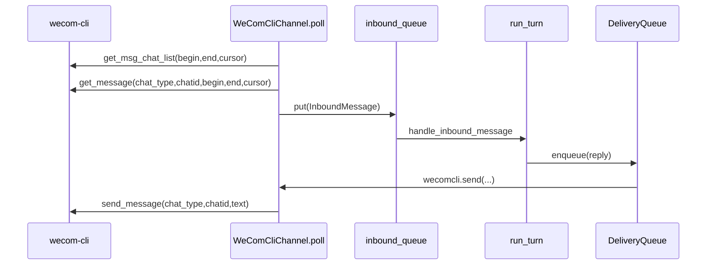
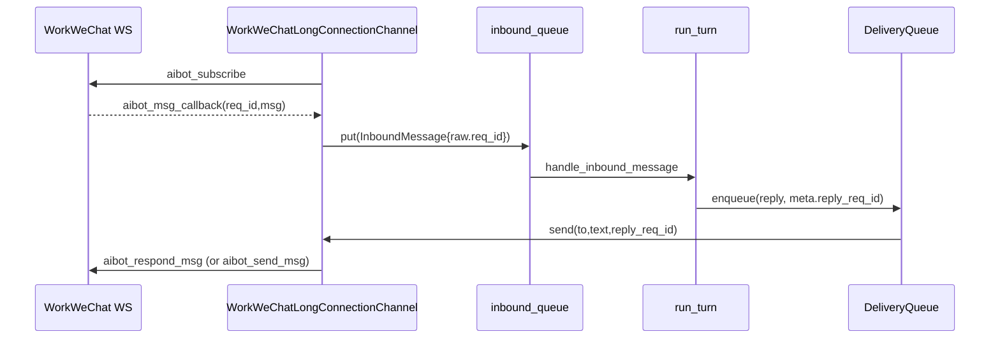

# tinyClaw 企业微信 Channel 与官方 CLI Skills 深度实现解析

> 更新时间：2026-04-02  
> 适用代码版本：当前仓库 `main.py` + `src/tinyclaw/channel/*` + `src/tinyclaw/intelligence/*`

---

## 1. 文档目标与范围

本文聚焦两件事：

1. **企业微信 Channel 的真实代码实现**
   - `wecomcli`（基于 `wecom-cli` 二进制的轮询桥接）
   - `workwechat`（官方 API 的 webhook/长连接两种模式）
2. **官方 wecom-cli skills 与接口能力**
   - 这些 skills 如何被 tinyClaw 发现、装载、注入 prompt
   - 每个 skill 对应的 CLI 命令能力、输入输出约束、典型工作流

这是一份“可直接用于技术复盘/面试讲解”的文档，尽可能具体到函数和运行链路。

---

## 2. 源码导航（先看这个）

### 2.1 Channel 抽象层

- `src/tinyclaw/channel/base.py`
  - `InboundMessage`：统一入站消息模型
  - `Channel`：同步通道抽象（`receive/send`）
  - `AsyncChannel`：异步通道抽象（`receive_all/send`）
  - `ChannelManager`：管理同步和异步通道实例

### 2.2 企业微信通道实现

- `src/tinyclaw/channel/wecom_cli.py`
  - `WeComCliChannel`：wecom-cli 轮询+发送
- `src/tinyclaw/channel/workwechat.py`
  - `WorkWeChatChannel`：Webhook 事件解析 + 官方 HTTP 发送
  - `WorkWeChatLongConnectionChannel`：官方 AI Bot WebSocket 长连接

### 2.3 运行时接线

- `main.py`
  - 注册 `wecom_cli_send_message` 工具
  - 初始化各 channel，注册路由 binding
  - poll/webhook/long-connection 的线程与循环
  - 入站处理、调用 Agent、分片后出站投递

### 2.4 配置

- `src/tinyclaw/config.py`
  - 读取 `.env`，生成运行时配置字典

### 2.5 技能装载

- `src/tinyclaw/intelligence/skills.py`
  - 扫描 skill 目录、解析 frontmatter、组装 skills block
- `src/tinyclaw/intelligence/prompt_builder.py`
  - 把 skills block 拼进系统提示词第 4 层

---

## 3. 运行入口与企业微信接线流程

下面从 `main.py` 的 server 模式看接线顺序。

## 3.1 wecom-cli 工具注册（模型可主动调用）

在 `main.py` 中，当 `wecom_cli_tool_enabled` 为真时，注册工具 `wecom_cli_send_message`：

- 位置：`main.py` 约 370 行
- Schema 字段：`chat_type`、`chatid`、`content`
- Handler：`_wecom_cli_send_message(...)`

这意味着：

- 模型在一轮对话里可直接发起工具调用，借助 `wecom-cli msg send_message` 主动发消息
- 这是“工具层发送”，不等同于 Channel 的 `deliver_fn` 被动发送

## 3.2 wecomcli 轮询通道初始化

- 位置：`main.py` 约 527 行
- 条件：`wecom_cli_poll_enabled`
- 初始化参数（从配置注入）：
  - `cli_bin`
  - `lookback_seconds`
  - `overlap_seconds`
  - `debug`

初始化成功后：

1. `ch_mgr.register(wecom_cli_channel)`
2. `bindings.add(... match_value="wecomcli" ...)`
3. 启动 `wecom_cli_poll_loop()` 线程（约 916 行）

## 3.3 workwechat 两种模式初始化

- 位置：`main.py` 约 549 行开始
- 模式变量：`workwechat_mode`，仅允许 `long/webhook/off`

### long 模式

条件：`WORKWECHAT_MODE=long` 且有 `bot_id/secret`

流程：

1. 构建 `ChannelAccount`
2. 实例化 `WorkWeChatLongConnectionChannel`
3. `start()` 启动内部线程 + 事件循环
4. `ch_mgr.register_async(...)`
5. `workwechat_sender = workwechat_long`

### webhook 模式

条件：`WORKWECHAT_MODE=webhook` 且有 `corp_id/corp_secret`

流程：

1. 实例化 `WorkWeChatChannel`
2. `ch_mgr.register(...)`
3. `workwechat_sender = workwechat_channel`
4. 在 `main.py` 约 1036 行，启动 `ThreadingHTTPServer`，用 `WorkWeChatWebhookHandler` 接收入站事件

## 3.4 出站统一投递入口 deliver_fn

`deliver_fn` 在 `main.py` 约 744 行：

- 针对不同 channel 分支调用对应 `.send()`
- workwechat 会透传 `reply_req_id`：
  - `workwechat_sender.send(to, text, reply_req_id=...)`

这一点非常关键：

- 对于 Work WeChat 长连接回调消息，若有 `req_id`，发送侧可用 `aibot_respond_msg` 语义回包

## 3.5 入站处理闭环

`handle_inbound_message`（约 827 行）中：

1. 从 `msg.raw` 抽取 `reply_req_id`
2. 做渠道特定前置处理（如 workwechat `__workwechat_session_started__`）
3. 路由到 agent (`resolve_route`)
4. 执行 `run_turn(...)`
5. 回复消息分片后 enqueue 到 delivery queue
6. 对 workwechat 回复时继续透传 `reply_req_id`

---

## 4. wecom-cli Channel 代码级实现细节

文件：`src/tinyclaw/channel/wecom_cli.py`

## 4.1 输出解包 `_unwrap_cli_payload`

函数：约 20 行

作用：

- 兼容两类返回：
  - 纯 JSON 对象
  - wecom-cli 包装格式：`{content:[{type:"text", text:"{...json...}"}], isError:false}`

价值：

- 降低 CLI 包装层变化对上层逻辑的影响

## 4.2 `_run_msg`：命令执行与异常兜底

核心行为：

- 构造命令：`[cli_bin, "msg", method, json.dumps(args)]`
- `subprocess.run(..., timeout=20)`
- 非 0 退出码记录 `last_error`
- 解析 payload 后返回 dict

设计取舍：

- 优点：简单直接，易排查
- 风险：CLI 是进程调用，吞吐受限于进程创建成本

## 4.3 `poll`：窗口+分页+去重+类型兜底

函数：约 150 行（核心）

### 时间窗口

- 首次：`now - lookback_seconds`
- 后续：`last_window_end - overlap_seconds`

这使得“上一轮末尾刚写入消息”不易漏掉。

### 先会话后消息

1. 循环调用 `get_msg_chat_list`，处理 `next_cursor`
2. 对每个 `chatid` 再调用 `get_message`

### chat_type 推断策略

`_infer_chat_type` 规则：

1. 优先读 `chat_type/chattype`
2. 若 `chat_name` 含“群”，判群聊
3. 默认先单聊

然后在 `poll()` 中：

- 若首猜单聊，会尝试 `[1, 2]`，避免因为会话类型缺失导致漏消息

### 消息去重

- 按 `msgid/message_id/id` 去重
- `_seen_msg_ids` 超 20000 时清空，控制内存

### 标准化入站

构造 `InboundMessage`：

- `channel="wecomcli"`
- `peer_id`：群聊 `chat:<chatid>`，单聊 `user:<chatid>`
- `raw` 保留 chat/message 原始结构

## 4.4 `send`：分片发送

函数：约 273 行

逻辑：

1. 解析 `to` 前缀确定 `chat_type`
2. 文本按 `MAX_TEXT_LEN=2048` 分片
3. 每片调用 `msg send_message`
4. 任一片失败即返回 `False`

`_chunk` 会优先在换行处分割，避免粗暴截断语义。

## 4.5 健康指标

`get_health` 提供：

- poll 次数、会话数、原始消息数、入站数
- 发送成功/失败计数
- 最近窗口时间、最近错误

`main.py` 的 poll 线程会周期打印这些指标（约 916 行起）。

---

## 5. Work WeChat 官方 Channel 代码级实现细节

文件：`src/tinyclaw/channel/workwechat.py`

## 5.1 Webhook 模式：`WorkWeChatChannel`

### Token 刷新

函数：`_refresh_token`（约 53 行）

- 调 `gettoken`
- 缓存 `access_token` 与过期时间
- 提前 300 秒刷新

### 发送分流

函数：`send`（约 85 行）

- `chat:<id>` -> `/appchat/send`
- `user:<id>` 或裸 ID -> `/message/send`

### 事件解析

函数：`parse_event`（约 121 行）

输入要求是“桥接层标准化 payload”：

- `text`
- `sender_id`
- `peer_id`
- `is_group`
- `raw`

如果配置了 `webhook_token`，会校验 token，不通过则丢弃。

说明：

- 该模式依赖外部 webhook 适配/归一化
- tinyClaw 只负责标准化后的解析与后续 Agent 流程

## 5.2 长连接模式：`WorkWeChatLongConnectionChannel`

### 启动模型

- `start()` 新线程
- 线程里建独立 asyncio loop
- `_run_forever()` 自动重连

### 订阅握手

`_subscribe()` 发送：

```json
{
  "cmd": "aibot_subscribe",
  "headers": {"req_id": "..."},
  "body": {"bot_id": "...", "secret": "..."}
}
```

返回 `errcode==0` 才进入事件循环。

### 事件循环

`_event_loop()` 做三件事：

1. 定时发 ping
2. 从 `_send_queue` 把待发包写入 ws
3. `ws.recv()` 收消息并解析成 `InboundMessage`

### `_parse_long_event()` 的兼容性设计

此函数是健壮性关键点：

- body 位置兼容：`payload.body` 或 `payload.data.body`
- 字段名兼容：
  - `msgid/msg_id`
  - `msgtype/msg_type`
  - `chattype/chat_type`
  - `eventtype/event_type`

支持事件：

1. `aibot_msg_callback`
   - 仅处理 `text` 消息
   - 去重 msg_id
   - 产出真实用户消息 InboundMessage
2. `aibot_event_callback` + `enter_chat`
   - 产出哨兵消息 `__workwechat_session_started__`
   - 用于首次入会欢迎语等逻辑

### send 的 respond/send 双策略

函数：`send`（约 394 行）

- 有 `reply_req_id`：发 `aibot_respond_msg`（回调语义回复）
- 无 `reply_req_id`：发 `aibot_send_msg`（主动发送）

这是 Work WeChat 回调链路体验好的核心。

---

## 6. 企业微信消息时序（端到端）

## 6.1 wecomcli 轮询模式



## 6.2 workwechat 长连接模式



---

## 7. 配置项总表（企业微信相关）

配置来源：`src/tinyclaw/config.py`

### 7.1 wecom-cli

- `WECOM_CLI_ENABLED`（遗留总开关）
- `WECOM_CLI_TOOL_ENABLED`（工具调用开关）
- `WECOM_CLI_POLL_ENABLED`（轮询通道开关）
- `WECOM_CLI_BIN`
- `WECOM_CLI_POLL_INTERVAL`
- `WECOM_CLI_HEALTH_LOG_INTERVAL`
- `WECOM_CLI_LOOKBACK_SECONDS`
- `WECOM_CLI_OVERLAP_SECONDS`
- `WECOM_CLI_DEBUG`

### 7.2 workwechat

- `WORKWECHAT_MODE`: `off|long|webhook`
- long 模式：
  - `WORKWECHAT_BOT_ID`
  - `WORKWECHAT_BOT_SECRET`
  - `WORKWECHAT_WS_URL`
  - `WORKWECHAT_PING_INTERVAL_SEC`
- webhook 模式：
  - `WORKWECHAT_CORP_ID`
  - `WORKWECHAT_CORP_SECRET`
  - `WORKWECHAT_AGENT_ID`
  - `WORKWECHAT_WEBHOOK_HOST/PORT/PATH`
  - `WORKWECHAT_WEBHOOK_TOKEN`

---

## 8. 官方 wecom-cli skills 的“实现机制”

很多人会误解：这些 skills 不是 Python 函数，而是 **Skill 文档驱动的执行规范**。

## 8.1 装载机制

`SkillsManager.discover()` 会扫描多个目录，包括：

- `workspace/skills`
- `workspace/.agents/skills`
- `~/.agents/skills`
- `cwd/.agents/skills`
- `cwd/skills`

每个 skill 目录内 `SKILL.md`：

- frontmatter 解析 `name/description/...`
- 正文 body 原样加入 skills prompt block

## 8.2 注入提示词

`build_system_prompt(...)` 在 full 模式会把 `skills_block` 加入系统提示词第 4 层。

结果：

- 模型会遵循 SKILL.md 里的流程和限制
- 通过工具/终端执行 `wecom-cli ...` 命令完成业务

---

## 9. 官方 skills 与接口能力矩阵（按领域）

## 9.1 消息：`wecomcli-get-msg`

核心接口：

- `get_msg_chat_list`
- `get_message`
- `get_msg_media`
- `send_message`

关键规则（文档里明确强调）：

- 时间窗口默认近 7 天
- `chat_type` 可能缺失，需要按上下文推断
- 非文本消息下载后必须主动告知本地路径并询问是否清理

与 Channel 代码的对应关系：

- `WeComCliChannel.poll()` 实际也按“先 chat_list 再 get_message”实现
- 且实现了 chat_type 兜底尝试，和 skill 规则一致

## 9.2 通讯录：`wecomcli-lookup-contact`

核心接口：

- `contact get_userlist`

用途：

- 将人名/别名映射到 `userid`
- 供消息、会议、待办、日程、智能表格 USER 字段复用

## 9.3 会议

- 查询：`wecomcli-get-meeting`
  - `list_user_meetings`
  - `get_meeting_info`
- 创建：`wecomcli-create-meeting`
  - `create_meeting`
- 管理：`wecomcli-edit-meeting`
  - `cancel_meeting`
  - `set_invite_meeting_members`

关键规则：

- 成员更新是全量覆盖，必须先查现有成员再合并
- 涉及人员输入必须先通过通讯录定位 userid

## 9.4 待办

- 列表：`wecomcli-get-todo-list` -> `get_todo_list`
- 详情：`wecomcli-get-todo-detail` -> `get_todo_detail`
- 编辑：`wecomcli-edit-todo` -> `create/update/delete/change_todo_user_status`

关键规则：

- 列表返回仅概览，**必须继续查详情**
- 人员 ID（creator/follower）展示前必须转姓名
- 删除是破坏性操作，先确认

## 9.5 日程：`wecomcli-manage-schedule`

核心接口：

- `get_schedule_list_by_range`
- `get_schedule_detail`
- `create_schedule`
- `update_schedule`
- `cancel_schedule`
- `add_schedule_attendees` / `del_schedule_attendees`
- `check_availablity`

关键规则：

- 查询窗口限定前后 30 天
- 返回时间戳需转可读时间
- 闲忙分析后再创建会议

## 9.6 文档与智能表格

- 文档：`wecomcli-manage-doc`
  - `get_doc_content`（异步轮询 `task_id`）
  - `create_doc`
  - `edit_doc_content`
- 表结构：`wecomcli-manage-smartsheet-schema`
  - `smartsheet_get_sheet/add/update/delete_sheet`
  - `smartsheet_get_fields/add/update/delete_fields`
- 表数据：`wecomcli-manage-smartsheet-data`
  - `smartsheet_get_records`
  - `smartsheet_add/update/delete_records`

关键规则：

- 先 schema 再 data
- USER 字段要先查 `userid`
- 删除类操作不可逆

---

## 10. Channel 与 Skills 的协同关系（核心认知）

可以把系统看成两层：

1. **传输层（Channel）**
   - 负责接入平台、收发消息、事件兼容、token/ws 生命周期
2. **能力层（Skills）**
   - 负责告诉模型“该调用哪些接口、按什么流程、何时确认、何时重试、如何展示”

二者通过 Agent 回合逻辑耦合，但职责清晰分离。

这套分层的直接收益：

- 平台接入变更（如 webhook 改 long）对业务流程影响小
- 业务流程升级（skill 文档增强）不必修改 channel 代码
- 多渠道共用同一批业务技能策略

---

## 11. 已体现的鲁棒性设计

本仓库在企业微信链路已实现以下关键鲁棒点：

1. wecom-cli 输出兼容解析（包装/裸 JSON 双格式）
2. 轮询窗口重叠，降低边界漏消息概率
3. chat_type 缺失场景兜底尝试 1/2
4. msg_id 去重，防重复处理
5. Work WeChat 长连接字段名兼容（多命名风格）
6. body 多层嵌套兼容（`body` vs `data.body`）
7. 回调 req_id 透传，优先使用 respond 命令回复

---

## 12. 面试讲解建议（可直接口述）

建议按下面顺序讲，最清晰：

1. 先讲抽象：`InboundMessage + Channel/AsyncChannel`
2. 再讲两条企业微信接入链：
   - wecomcli（轮询）
   - workwechat（webhook/长连接）
3. 讲主流程闭环：入站 -> route -> run_turn -> delivery
4. 讲为什么要 skills：
   - 能力策略外置
   - 复杂业务流程可迭代
5. 最后讲鲁棒性细节与边界场景

---

## 13. 可继续增强的点（建议）

1. **统一指标上报**
   - 将 wecomcli health + workwechat ws 指标统一打到一个 metrics 接口
2. **失败重试策略统一**
   - 目前技能文档里有“最多重试三次”规则，代码层可抽象通用 retry policy
3. **死信队列增强**
   - 对持续失败的企业微信出站消息打标签（channel/peer/error），便于回放
4. **协议测试样本库**
   - 把 workwechat 各类回调 payload 样本固化为测试夹具，防字段变更回归

---

## 14. 关键源码定位清单

- `src/tinyclaw/channel/base.py`
- `src/tinyclaw/channel/wecom_cli.py`
- `src/tinyclaw/channel/workwechat.py`
- `src/tinyclaw/config.py`
- `main.py`
- `src/tinyclaw/intelligence/skills.py`
- `src/tinyclaw/intelligence/prompt_builder.py`
- `~/.agents/skills/wecomcli-*/SKILL.md`

---

如果你希望，我可以在下一版文档里继续补两块：

1. 按“故障场景”给出逐步排查手册（例如：收得到消息但发不出去、长连接反复重连、wecom-cli 返回包装异常）。
2. 产出一份“面试问答版”附录（STAR 口径 + 追问答案 + 风险与优化）。
